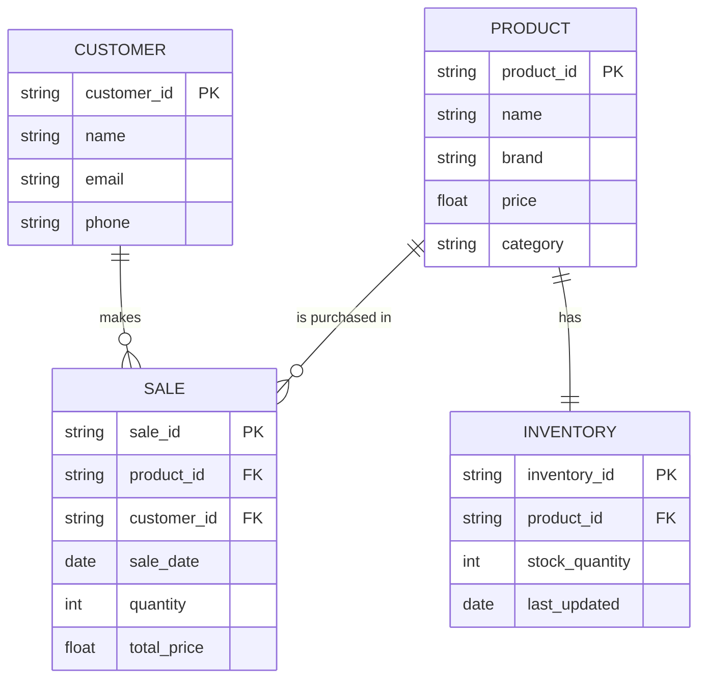

	
##PRODUCT
The Product entity represents the Nike merchandise available in the store. Key attributes 
include product_id (PK), name, brand, price, and category. This entity forms the core of the 
inventory system, linking to both Sale and Inventory entities. 

##CUSTOMER
The Customer entity stores information about individuals who make purchases from the Nike shoe store. 
Essential attributes include customer_id (PK), name, email, and phone. This entity is crucial
for maintaining customer relationships, tracking purchase history, and enabling personalized 
marketing efforts. It directly connects to the Sale entity, allowing for detailed analysis of 
customer buying patterns and preferences.

##SALE
The Sale entity represents individual transactions in the Nike shoe store, linking customers 
to the products they purchase. Key attributes include sale_id (PK), product_id (FK), customer_id (FK),
sale_date, quantity, and total_price. This entity enables tracking of sales trends, customer 
purchase histories, and financial reporting, while facilitating inventory updates.

##INVENTORY
The Inventory entity manages stock levels for each product in the store, ensuring real-time 
visibility of available items. Key attributes include inventory_id (PK), product_id (FK), 
stock_quantity, and last_updated. It supports effective stock management, triggers reorder 
processes when inventory is low, and provides essential data for demand forecasting and 
financial reporting.  Together with the Sale entity, it ensures efficient operations and 
enhances customer satisfaction through accurate product availability.
